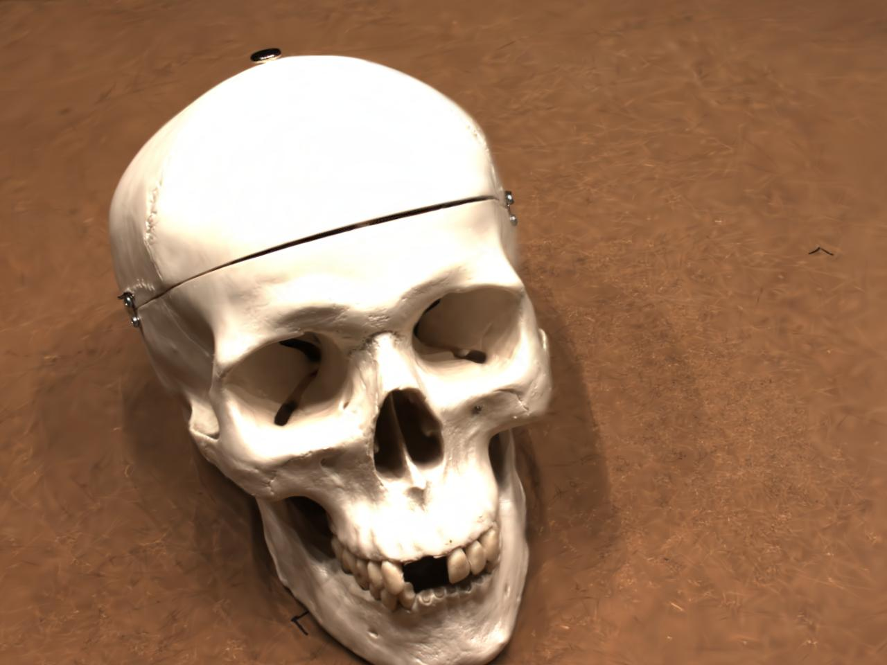
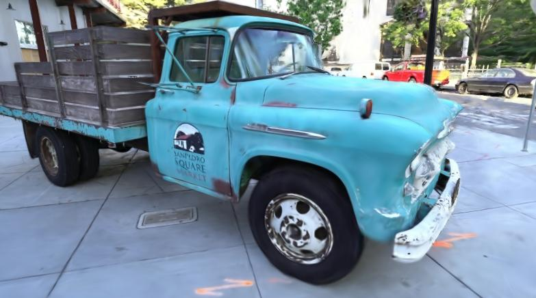

This code is a non-official 2DGS implementation. The current code only implements the projection process in CUDA, including forward and backward. The depth distortion and normal regularization used in 2DGS will be updated soon. Relevant derivations can be found in 2DGS_code_supp.pdf, which is only available in Chinese. 
Ideally, in any environment configured with 3dgs, first run <br>
```pip install submodules/two-d-diff-gaussian-rasterization```<br>
then execute <br>
```python --conf_path ./config/base.yaml```<br>

Here are some examples. A more comprehensive comparison will be released later.
dtu scan65 (4000 steps)
<p align="center">
  
</p><br>
Tanks and Temples (5000steps)
<p align="center">
  
</p><br>


